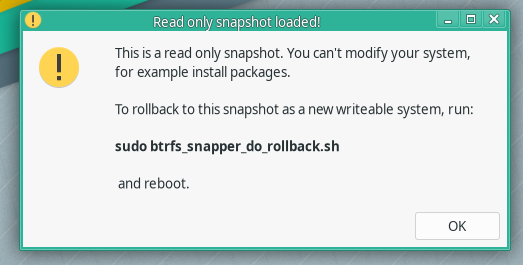
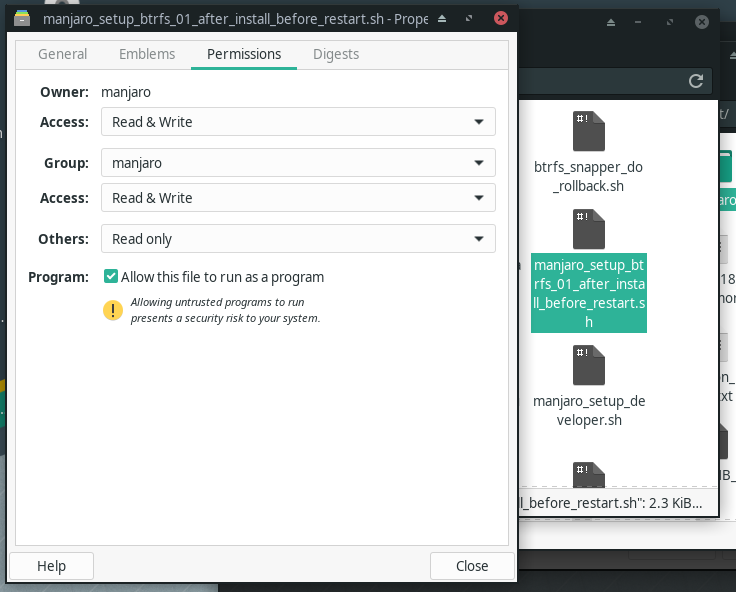
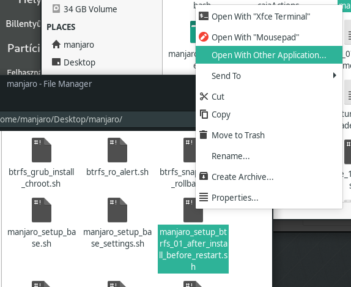
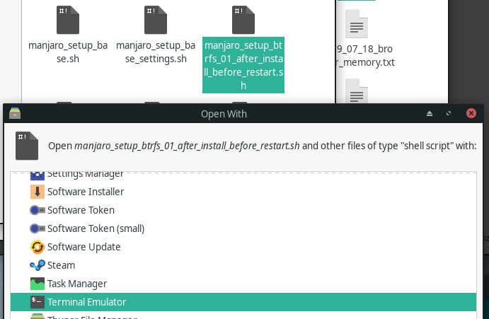

These scripts can be used to automate some tasks to setup a complete manjaro system. Also works with manjaro32, but not fully tested.

# btrfs snapshots with snapper, with easy rollback
With btrfs filesystem, we can set up a system with snapshots. With snapper and grub, we can rollback to a previous state, if anything goes wrong after a package install, or system update or anything else.

The basic precondition is to create a btrfs root, and a swap partition at installation time.

There are videos about the installation and setup with detailed instructions here:
https://www.youtube.com/watch?v=-fT92-jGniI

By default the installer will create only the */home* subvolume. Theese scripts will do additional things to set up a complete btrfs system, prepared for an easy rollback.

## 1. after the installation finished, but before the restart
When the installer finished, do not restart the system yet!
Run this script, right after the installation finished: *manjaro_setup_btrfs_01_after_install_before_restart.sh*.

It will do the following:
* if more than one partitions found with btrfs filesystem, prompt to choose the target 
* set the default subvolume
* create subvolume */var* to be able to boot into a read-only snapshot
* create subvolume on */usr/local*
* move the pacman database to */usr/var/pacman* to reflect the state of the snapshot

Creating the */var* subvolume will greatly reduce the size of the snapshots, and give the ability to boot a read only snapshot, to do the rollback from there.

After this script has finished, restart.

## 2. after the first start
When you boot into the newly installed system:
Before doing anything else, run the script *manjaro_setup_btrfs_02_after_install_after_restart.sh*.

It will do the following:
* call *manjaro_setup_base.sh*
  * sync system time
  * try to set up the fastest mirror
  * do a full update, and install some necessary tools, like rsync, lsof ...
  * on 64bit systems, install the kernel bootsplash
  * call *manjaro_setup_base_settings.sh*
    * enable AUR repository
    * enable auto key retrieve for AUR download
  * fix boot delay problem
  * install some handy stuff from aur
* fix the "sparse file not allowed" error message on startup
* create snapper config
* move snapshots to a separate subvolume
* skip snapshots from updatedb
* install some btrfs related package to be able to create snapshots on package install, and to list snapshots in grub menu
* copy some scripts to */usr/local/bin*. One of them will alert after boot if the btrfs filesystem is a read only snapshot, and give the command to do the rollback

## rollback to a previous state

If you want to go back to a previous state of the system, you must reboot, and select the a snapshot from the grub menu (under 'Select snapshot') to boot into. After you login, a windows will warn you, that this is a read only snapshot. It also give you the command to do the rollback. After you are sure that you want to rollback to that state, you should run: *sudo btrfs_snapper_do_rollback.sh*

After the reboot, you will get back the selected state of your system, like a time travel.

Note: The user's */home* partition is not contained in the snapshot. 

# encrypted home

Because you can only create encrypted home for another not logged in user, you must create a separate user to set up the encrypted home for.

The *manjaro_setup_encrypted_home.sh* script will set the ecryptfs pam moduls, and encrypt the home dir if the user has no running processes (not logged in).

Follow the original instructions from the encryption output at the end of the process: the target user should test if he/she can log in before the restart.

After setting encrypted home(s), a restart is advised.

# xfce desktop modifications

You should run this script for a user, that is not logged in currently.

The script *manjaro_setup_xfce_desktop.sh* will appy some modifications like add dockbarx dock, add some indicators to the panel, etc ...

The script *manjaro_setup_xfce.sh* needs to be run before this script!

# fix key problem during package update

Rarely required, but if there are package key problems, the script *manjaro_setup_keyfix.sh* will refresh the package signing keys.

If we get a key error during an update, we can try to fix it, with this script.

# other scripts

The rest of the scripts are self-explanatory, and commented. Feel free to explore.

For example, if you want to test these scripts in virtualbox, use can use the *manjaro_setup_virtualbox.sh* script to install the necessary packages for a virtualbox client.

# executing the scripts from gui

The scripts can be executed also from gui:

# Disclaimer

You should test the scripts before creating a new live system with them. You can also modify them freely to your needs.

Always have backup!
